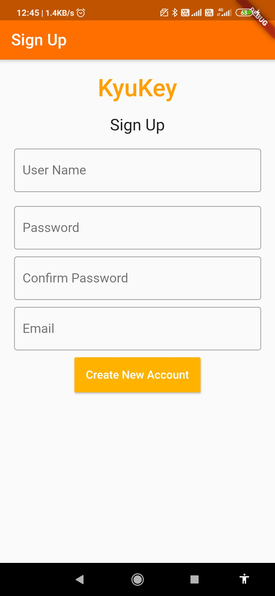
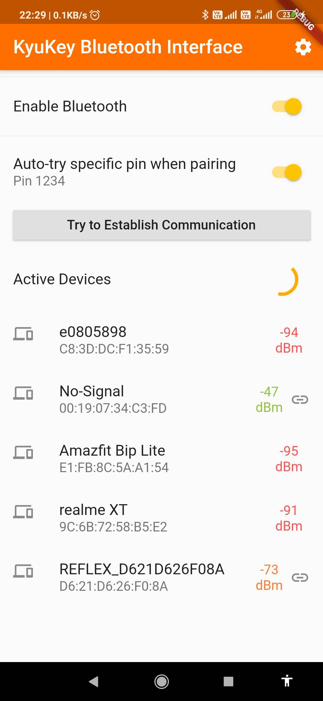

# KyuKey Bluetooth suite
Repository contains Bluetooth Suite to interface with Smartlocks based on BLE enabled embedded systems.

## Preview
1. Login for Owners

Simple login page to enable user to access the locks that they own
2. Bluetooth Connect

Connect to your to start communicating with it
3. Reconfigure Device Settings

Reconfigure WiFi Credentials through which the lock connects to the internet. This also gives information about the hardware status of the lock
